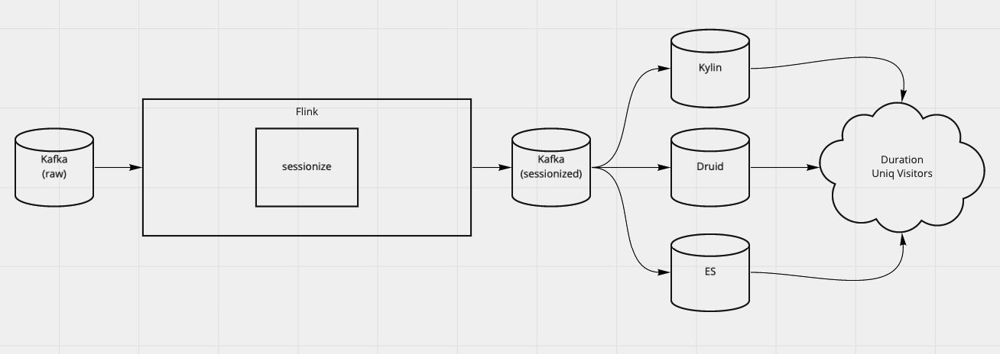
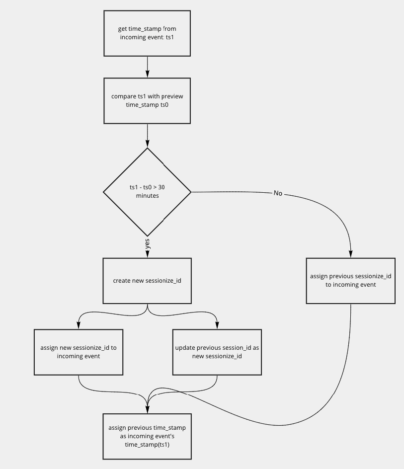
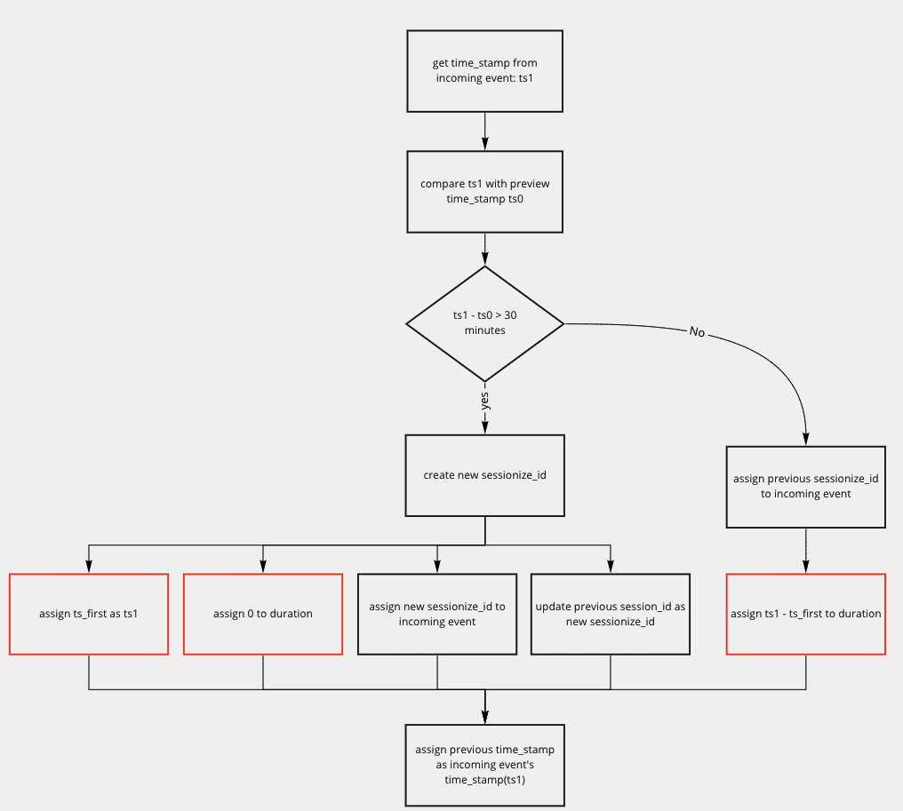
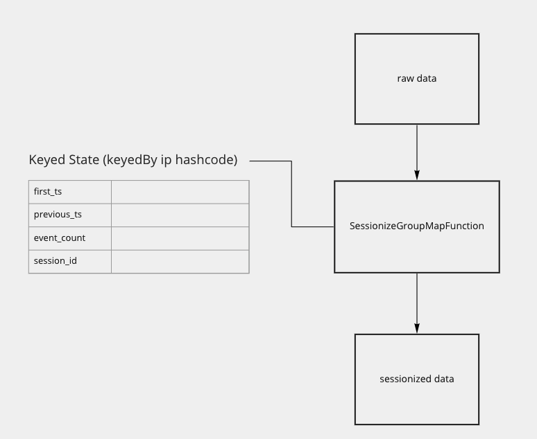

# Realtime Solution


## Solution overview

This solution uses Flink application to consume from Kafka topic.
It calculates session by assigning the `session_id` to the events.
Then the application will put the sessionized events to output kafka topic, from which the OLAP engine will then get data from for further analytics for duration and loyal users.




## Design considerations and details

### Delayed data and watermark

From the inspection of input data, it seems that the delayed data is very common from the input data set. To handle this, we need to [apply watermark](./src/main/scala/processes/sorting/EnsureOrderWatermark.scala) to ensure orderness for the incoming stream.

### Process
#### Sessionize

For each incoming event from a given user(`ip`), to assign `session_id` to the event, we only need the following information always in the process:

- the `time_stamp` of previous event from the same user
- the `session_id` of the previous event

If this user's current event's `time_stamp` is more than 30 minutes after the `time_stamp` the previous `time_stamp`, then the Flink application will assign a new `session_id`. Otherwise, the previous `session_id` will be assigned intead.



> To be consistent with my previous [batch solution](../), in the actually Flink process, I also cut session if
- there are too many events in the current session.
- the duration is already extremely long.


#### Duration

Since the duration of the session requires the information in the future, for those ongoing sessions, it can't be calculated in realtime. But we can still calculate the duration of the session "so far".

And then in the output of the data, we use following query to get the duration of the sessions:

```sql
SELECT SUM(session_duration), ip
FROM (
  SELECT MAX(duration), ip, session_id
  FROM output_t
  GROUP BY ip, session_id
) as duration_t
GROUP BY ip
```

To achieve that, we will need **"the `time_stamp` of the first event in the session"**.
Every time, we process an event, we will use this `time_stamp` to calculate the current duration of the ongoing session.



## Implementation

In the Flink process, I use "[Managed Keyed State](https://ci.apache.org/projects/flink/flink-docs-release-1.13/docs/dev/datastream/fault-tolerance/state/#using-keyed-state)" with Time-To-Live setting as cache to keep above 3 pieces of information we need to calculate session and duration:

- the `time_stamp` of previous event from the same user
- the `session_id` of the previous event
- the `time_stamp` of the first event in the session

Alone with the Keyed State, I use [RichMapFunction](https://ci.apache.org/projects/flink/flink-docs-master/api/java/org/apache/flink/api/common/functions/RichMapFunction.html) for the main process in [SessionizeGroupMapFunction](./src/main/scala/processes/sessionize/SessionizeGroupMapFunction.scala).



> **Why Not Window Function?**
>
> There are two reason in the consideration of the choice of using Keyed State instead of Window function.
>
> The first one is the actual scenario of usage of this realtime pipeline. If we use Window Function, the session or the duration result won't be put into the output storage before the session ends. That means, assuming there are sequence of events from only one `ip` and the session is still on-going, on the output end, there will be no reading at all, which, in my opinion, contradicts the choice of applying realtime approach in the first place.
> With the current implementation, for ongoing sessions, we are able to count their events, urls, and current going duration, which is much more valuable.
>
>The second reason why I didn't choose to use Window Function, is from a performance perspective. If use Window Function, Flink cluster needs large heap size to keep events inside cluster to wait for windows to be merged. However, with the current implementation, the process is pure map process, there is no aggregation or window merging, meaning no event will be stored in Flink application/cluster to be wait for the next event.


## Further Tuning

Here are some points we can further optimize the process.

### Potential Skew

Now, we are assuming the input kafka has all data evenly distributed in all partitions, but if not, we need to shuffle the data in Flink to make sure the data won't be skewed after the input source.

More than that, to sessionize the input stream, I [used a mod of hashCode of ip to rebalance](./src/main/scala/Sessionize.scala) the traffic, which should make traffic spread evenly enough, but depending on the natural of the input data and the distribution of ip address, the rebalanced stream might still be skewed. If that is the case, we can implemente a more complicated hash partitioner.

### Managed Memory

Since we rely on [Keyed State](https://ci.apache.org/projects/flink/flink-docs-release-1.13/docs/dev/datastream/fault-tolerance/state/#using-keyed-state) as cache to store the ongoing session state, and also set a TTL to avoid ever-growing cache size.
In this implementation, I assumed we will be using RocksDB as the state backend since that is the only suitable state backend for large state size.

However, there are a few things to consider when use RocksDB:
- We should keep hot cache in managed memory instead of SST files as much as possible to keep the performance optimal.
- Even if the out dated cache will be cleared up by RocksDB compaction, if the SST files grow too big. The clearing up itself will start to pend.

With that being said, we need to keep a large cache size in memory.
Since the "memory cache part" of RocksDB is allocated in managed memory, we probably need to **increase the size of [managed memory](https://ci.apache.org/projects/flink/flink-docs-master/docs/deployment/memory/mem_setup_tm/#configure-heap-and-managed-memory) for the Flink cluster** and increase the RocksDB threads by

### Network buffer tuning

Since we are rebalancing the traffic by `KeyBy` before the sessionize process, we need to ensure that network IO won't cause actual back pressure.
If we encounter back pressure due to network, which can be verified by checking the [in/out pool usage of network buffer](https://flink.apache.org/2019/07/23/flink-network-stack-2.html), we can tune up the following configs to give more network performance:
- taskmanager.network.memory.fraction
- taskmanager.network.memory.buffers-per-channel
- taskmanager.network.memory.floating-buffers-per-gate
